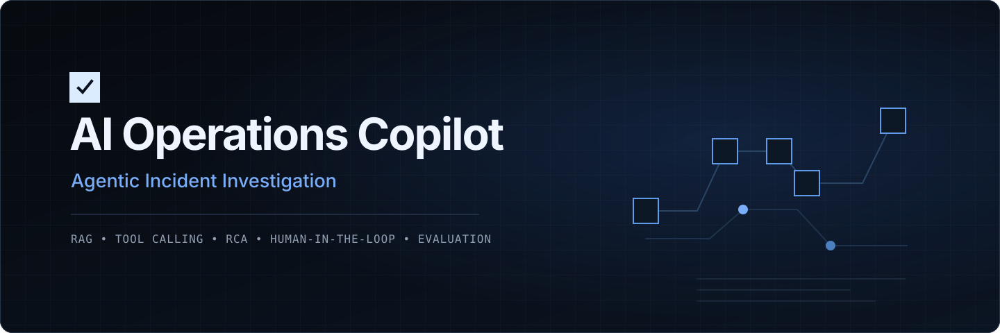
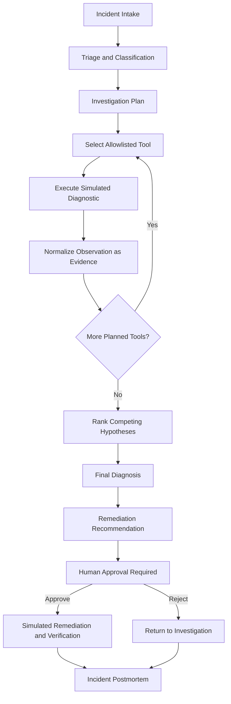
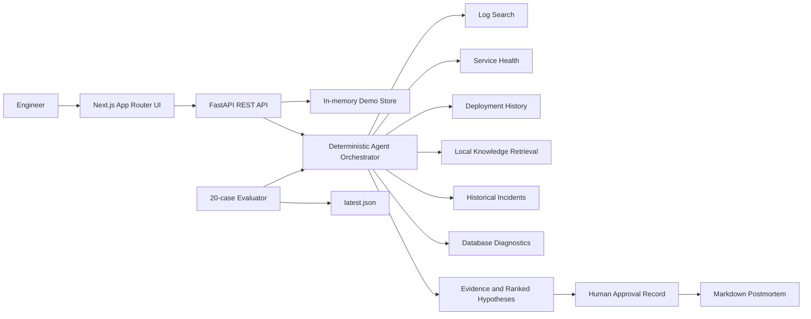

<div align="center">
  
</div>

# AI Operations Copilot

> **Agentic AI platform for automated incident investigation, root-cause analysis, RAG-powered diagnostics and human-approved remediation.**

A production-style AI operations command center that investigates software incidents by planning diagnostic steps, calling safe tools, collecting evidence, ranking root-cause hypotheses and producing structured postmortems.

[](backend/) [](backend/app/main.py) [](frontend/) [](frontend/) [](backend/app/agent.py) [](backend/app/tools.py) [](docker-compose.yml) [](https://github.com/Sreedev-a/AI-Operations-Copilot/actions/workflows/ci.yml)

**Status: Active portfolio project**

The current repository provides a deterministic, reproducible demo environment using synthetic operational data. Production integrations are intentionally simulated or read-only.

## What It Does

AI Operations Copilot turns an operational symptom into a structured, observable investigation. An engineer can load a seeded scenario or create an incident, run the agent, inspect every diagnostic call, compare ranked hypotheses, approve or reject a proposed **SIMULATED ACTION**, and export a Markdown postmortem.

The application is designed as an engineering product rather than a general-purpose chatbot: evidence, traceability, safety boundaries, and repeatable evaluation are first-class parts of the workflow.

## Key Features

### Agentic Incident Investigation

- Accepts incident title, description, service, environment, and severity.
- Classifies the affected service and severity during incident intake.
- Creates a deterministic investigation plan from the scenario's expected tools.
- Executes selected diagnostics and converts observations into evidence.
- Generates and ranks three competing root-cause hypotheses.
- Recommends a scenario-specific simulated remediation.
- Produces a structured report with impact, timeline, cause, evidence, resolution, and preventive actions.

### Diagnostic Tool Calling

The orchestrator can invoke only the six names in `ALLOWED_TOOLS`. Each execution records structured input, output, success status, and measured latency. Unsupported tool names raise an error instead of reaching a generic execution layer.

### Root-Cause Analysis

Investigations produce a primary hypothesis and two alternatives. Each hypothesis exposes supporting and contradicting evidence, a rank, a qualitative level, and agent confidence. Demo confidence values are deterministic system outputs for presentation; they are **not calibrated real-world probabilities**.

### Human-in-the-Loop Safety

Every recommendation is labeled **SIMULATED ACTION** and enters `Awaiting Approval`. The operator can approve or reject it; the API records the decision, actor, timestamp, simulated status, and verification message. No real restart, rollback, scaling, cache, or database mutation is performed.

### RAG Knowledge System

Six fictional operational documents cover database pools, payment architecture, rollbacks, Redis, authentication, and API timeouts. In demo mode, retrieval tokenizes the query and documents, ranks overlap, and returns the top three relevant documents with scores. Newly submitted documents receive lightweight chunk-count metadata; this prototype does not yet persist or embed chunks in a vector database.

### Agent Observability

The incident detail page includes an **Agent Trace** showing the orchestrator step, selected tool, input/output detail, status, and latency. Investigation events also form a human-readable timeline from intake through recommendation. The current deterministic tools return successful traces; the schema is prepared to carry execution details, while a dedicated persisted error-trace path remains roadmap work.

### Evaluation Framework

The evaluator runs the real orchestrator over all 20 seeded scenarios and measures root-cause correctness, expected-tool overlap, evidence coverage, unnecessary calls, recommendation correctness, and end-to-end orchestration latency. Results are saved as a reviewable JSON artifact.

## How It Works

1. An engineer creates an incident or loads a synthetic scenario.
2. The agent classifies the severity and affected service.
3. It creates an investigation plan from structured incident state.
4. It selects tools from the explicit diagnostic allowlist.
5. Tool observations are normalized into evidence.
6. The agent generates a primary cause and competing hypotheses.
7. Supporting and contradicting evidence determine the ranking.
8. The agent recommends a scenario-specific remediation.
9. The simulated action waits for an explicit approve/reject decision.
10. The system generates an exportable incident postmortem.



## Diagnostic Tools

| Tool | Purpose | Example evidence returned by the demo implementation |
| --- | --- | --- |
| Log Search (`logs`) | Returns seeded structured service logs | Error messages, dependency thresholds, trace IDs |
| Service Health (`health`) | Inspects simulated service and dependency state | Availability state, uptime, error rate, p95 latency |
| Deployment History (`deployments`) | Retrieves recent fictional releases | Version, commit, deployment time, status |
| Knowledge Search (`knowledge`) | Ranks fictional runbooks and architecture notes | Relevant documents and lexical scores |
| Historical Incidents (`history`) | Finds seeded incidents for the same service | Prior root cause, resolution, similarity |
| Database Diagnostics (`database`) | Performs read-only simulated diagnostics | Connections, pool utilization, slow-query count, availability |

The current log tool receives the incident service plus optional structured parameters; advanced time-range, level, and free-text filtering are future extensions rather than current claims.

## Demo Scenarios

The repository includes **20 synthetic demo incidents**. They are fictional test fixtures—not incidents from real companies—and each defines an expected root cause, diagnostic tool set, and mitigation.

| Area | Representative scenarios |
| --- | --- |
| Data | Connection-pool exhaustion, schema mismatch, slow ledger query |
| Cache | Redis unavailable, cache stampede |
| Deployment | Checkout regression, readiness-path change, dependency regression |
| Configuration and identity | Expired API token, incorrect JWT issuer, expired certificate, CORS rejection |
| Infrastructure | Disk exhaustion, DNS failure, worker crash loop, queue backlog |
| Performance | Memory leak, external API rate limiting, GPU inference queue saturation |

## Example Investigation

The first seeded case follows this real deterministic path:

```text
Incident: Database connection exhaustion on payment-api
  ↓
Agent classifies the incident and plans four diagnostics
  ↓
Log Search → errors consistent with connection-pool exhaustion
  ↓
Deployment History → v2.4.1 aligns with symptom onset
  ↓
Database Diagnostics → 92/100 connections and 96% pool utilization
  ↓
Historical Incidents → related payment-api resolutions
  ↓
Primary hypothesis: Database connection pool exhaustion
Agent confidence: 91% (deterministic demo output)
  ↓
Recommended SIMULATED ACTION: rollback deployment
  ↓
Human approval or rejection is recorded
  ↓
Markdown postmortem generated
```

## Product Tour

The product includes six focused views:

- **Operations Overview** — active, critical, and resolved counts; investigation metrics; recent incidents; severity distribution.
- **Incidents** — searchable incident inventory with severity, service, environment, status, investigator, and AI state.
- **AI Investigation** — investigation timeline, evidence-backed RCA, ranked alternatives, approval controls, and report export.
- **Agent Trace** — each orchestration and tool step with status and latency.
- **Knowledge Base** — fictional runbooks used by local retrieval.
- **Evaluations** — measured results for deterministic synthetic cases.

Automated browser capture is not part of the repository toolchain, so this README intentionally does not include fabricated screenshots. The full interface is available locally using the verified Docker command below.

## Architecture



| Layer | Responsibility |
| --- | --- |
| Next.js UI | Dashboard, incident workflows, trace inspection, approvals, knowledge, and evaluation views |
| FastAPI | Validated REST endpoints, CORS, incident lifecycle, report export, and demo reset |
| Agent orchestrator | Plans scenario tools, gathers evidence, ranks hypotheses, and recommends remediation |
| Tool system | Six explicit, read-only or simulated diagnostic adapters |
| Demo store | In-process incidents, knowledge, investigations, approvals, reports, and evaluation runs |
| PostgreSQL service | Compose-ready infrastructure boundary; durable repository integration is not implemented yet |

## AI Modes

### Demo Mode — implemented

```env
AI_MODE=demo
```

Demo mode requires no API key or paid service. It uses deterministic reasoning, local lexical retrieval, fictional knowledge documents, and synthetic incidents for reproducible demonstrations and tests.

### OpenAI Mode — planned

`.env.example` reserves `AI_MODE=openai` and `OPENAI_API_KEY`, but the current source does **not** call the OpenAI API. Provider-backed generation and embeddings remain roadmap items. Never place real keys in committed files.

## AI Evaluation

Results below are read from [`evaluations/results/latest.json`](evaluations/results/latest.json), generated on 20 cases at `2026-08-19T00:09:33Z`.

| Metric | Result |
| --- | ---: |
| Root Cause Accuracy | 100% |
| Tool Selection Accuracy | 100% |
| Evidence Coverage | 100% |
| Recommendation Accuracy | 100% |
| Average Tool Calls | 3.05 |
| Average Investigation Latency | 0.0485 ms |

These results are produced on deterministic synthetic demo scenarios and are intended to verify scenario conformance, not claim performance on unseen production incidents.

Run a fresh evaluation with `make eval`. The evaluator does not hard-code a pass result: it compares the orchestrator's predicted cause, selected tool set, gathered evidence count, and recommendation against each scenario definition.

## API Overview

| Method | Endpoint | Purpose |
| --- | --- | --- |
| GET | `/health` | Runtime health and demo-mode status |
| GET | `/api/dashboard` | Seeded dashboard metrics and recent incidents |
| GET | `/api/incidents` | List and filter incidents |
| POST | `/api/incidents` | Create a validated incident |
| GET | `/api/incidents/{id}` | Incident, investigation, and approval detail |
| POST | `/api/incidents/{id}/investigate` | Run the agent investigation |
| GET | `/api/incidents/{id}/trace` | Return the agent trace |
| POST | `/api/incidents/{id}/approval` | Approve or reject a simulated action |
| GET | `/api/incidents/{id}/report` | Export the generated Markdown report |
| GET | `/api/knowledge` | List or search knowledge documents |
| POST | `/api/knowledge` | Add a validated document to runtime memory |
| GET | `/api/evaluations` | List evaluation runs from this process |
| POST | `/api/evaluations/run` | Run and persist the 20-case evaluation |
| POST | `/api/demo/reset` | Reset in-memory demo data |

Interactive OpenAPI documentation: [http://localhost:8000/docs](http://localhost:8000/docs).

## Tech Stack

| Area | Technologies and concepts |
| --- | --- |
| Frontend | Next.js 16 App Router, React 19, TypeScript 5, Lucide React, custom responsive CSS |
| Backend | Python 3.13, FastAPI, Pydantic, Uvicorn, pytest |
| AI engineering | Deterministic orchestration, structured tool calling, lexical retrieval, evidence synthesis, hypothesis ranking, HITL, evaluation |
| Data | In-memory demo store, synthetic incident fixtures, JSON evaluation artifact; PostgreSQL 17 configured in Compose for future persistence |
| DevOps | Multi-stage Docker build, Docker Compose health checks, GitHub Actions |

SQLAlchemy and SQLite/PostgreSQL connection settings are present as architecture dependencies, but the current application state is in memory. The documentation deliberately distinguishes configured infrastructure from implemented persistence.

## Project Structure

```text
AI-Operations-Copilot/
├── backend/
│   ├── app/
│   │   ├── agent.py          # Investigation orchestration and reports
│   │   ├── data.py           # 20 incidents, logs, and six runbooks
│   │   ├── evaluation.py     # Scenario-conformance metrics
│   │   ├── main.py           # FastAPI routes and validation
│   │   ├── store.py          # In-memory runtime state and artifacts
│   │   └── tools.py          # Allowlisted diagnostic tools and retrieval
│   ├── tests/test_api.py
│   ├── Dockerfile
│   └── requirements.txt
├── frontend/
│   ├── src/app/              # App Router pages
│   ├── src/components/       # Shared application shell
│   └── Dockerfile
├── evaluations/results/      # Measured evaluation JSON
├── docs/assets/              # Repository presentation assets
├── .github/workflows/ci.yml
├── docker-compose.yml
├── Makefile
└── README.md
```

## Use Cases

This repository is a portfolio/prototype implementation for exploring:

- **SRE incident triage** — accelerate structured first-pass diagnosis during service failures.
- **DevOps troubleshooting** — correlate symptoms with fictional deployments, logs, and health signals.
- **Platform engineering** — model consistent investigations across internal services.
- **AI operations research** — experiment with agent planning, tools, observability, and evaluation.
- **Support engineering** — translate repetitive troubleshooting procedures into guided workflows.

It does not claim production adoption or direct access to real infrastructure.

## Safety & Security Design

- Explicit six-tool allowlist; unknown tool names are rejected.
- Diagnostic results are seeded, read-only, or simulated.
- No arbitrary shell-command or SQL execution interfaces.
- Remediation never touches infrastructure and always requires an approve/reject decision.
- Pydantic validates incident and knowledge-document lengths.
- CORS is limited to the local frontend origin.
- Secrets are environment variables; `.env` files are ignored by Git and Docker.
- Docker contexts exclude Git metadata, local environments, dependencies, caches, logs, and build outputs.

This is a safe demo boundary, not a replacement for production authorization, tenancy, RBAC, audit retention, or secrets management.

## Getting Started

### Prerequisites

The checked-in CI and containers use:

- Python 3.13
- Node.js 22 and npm
- Docker with Compose v2 for the container option

### Option A — Local Development

Start the backend:

```bash
cd backend
python3 -m venv .venv
source .venv/bin/activate
pip install -r requirements.txt
uvicorn app.main:app --reload
```

In another terminal, start the frontend:

```bash
cd frontend
npm install
npm run dev
```

### Option B — Docker

```bash
docker compose up --build
```

The verified Compose stack starts PostgreSQL, waits for its health check, starts FastAPI, waits for `/health`, and then starts Next.js.

| Service | URL |
| --- | --- |
| Web application | [http://localhost:3000](http://localhost:3000) |
| REST API | [http://localhost:8000](http://localhost:8000) |
| Swagger UI | [http://localhost:8000/docs](http://localhost:8000/docs) |

Demo data seeds automatically in process memory.

## Development Commands

| Command | Purpose |
| --- | --- |
| `make test` | Run pytest, frontend lint, typecheck, and production build |
| `make eval` | Run all 20 evaluation scenarios and update the latest JSON artifact |
| `make seed` | Reset the running API's in-memory demo state |
| `make docker` | Start the Compose stack with builds |
| `cd backend && pytest` | Run backend API/workflow tests |
| `cd frontend && npm run dev` | Start the frontend development server |

## CI

The [GitHub Actions workflow](.github/workflows/ci.yml) runs on pushes and pull requests. Its backend job installs Python 3.13 dependencies, executes pytest, and runs the evaluator. Its frontend job installs dependencies with `npm ci`, then runs ESLint, TypeScript checking, and the Next.js production build.

## Troubleshooting

### Backend does not start

Run from `backend/` so Python can resolve the `app` package. Confirm dependencies are installed, then check `http://localhost:8000/health`.

### Frontend cannot reach the API

For local development, keep `NEXT_PUBLIC_API_URL=http://localhost:8000`. Compose separately uses `API_INTERNAL_URL=http://backend:8000` for server-rendered requests between containers.

### Docker build cannot find `evaluations/`

Run Compose from the repository root. The backend intentionally uses the repository root as its build context because its image includes both `backend/app/` and `evaluations/`.

### Port 3000 or 8000 is already in use

Stop the conflicting process or change the published port in `docker-compose.yml`. Keep the frontend's API URL aligned with the published backend port.

### Reset demo data

With the API running, use `make seed` or `POST /api/demo/reset`.

### AI mode confusion

Use `AI_MODE=demo`. `AI_MODE=openai` is reserved but not implemented in the current codebase.

## Why I Built This

I built AI Operations Copilot to explore how AI agents can move beyond chat interfaces into structured operational workflows. Incident response is a useful systems problem because credible assistance requires planning, controlled tool use, retrieval, evidence synthesis, and a visible chain of reasoning—not just a fluent answer.

The project also treats human oversight and evaluation as core engineering concerns. Remediation is simulated and approval-gated, while deterministic scenarios make agent behavior inspectable, testable, and reproducible.

## Roadmap

- [ ] Durable PostgreSQL repositories
- [ ] Streaming investigation events
- [ ] Pluggable LLM and embedding providers
- [ ] Vector-backed document chunk storage
- [ ] Real observability integrations
- [ ] GitHub deployment-history connector
- [ ] Prometheus integration
- [ ] Grafana integration
- [ ] Role-based access control
- [ ] Persistent incident and approval history
- [ ] Persisted tool-error traces and retry policy

## Author

**Sreedev A**<br />
AI/ML Engineer

[GitHub](https://github.com/Sreedev-a) · [Portfolio](https://sreedev-a.github.io) · [LinkedIn](https://www.linkedin.com/in/sreedev514162/)
