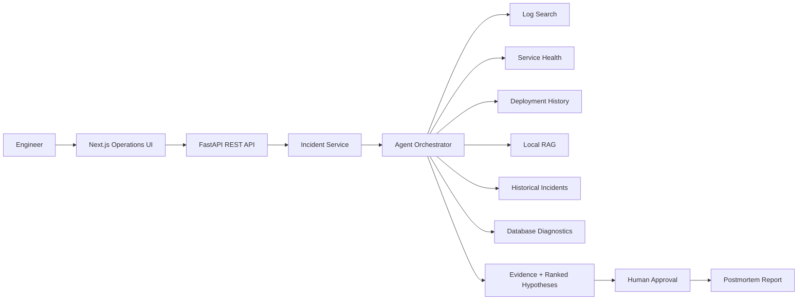

# AI Operations Copilot

> Agentic AI platform for automated incident investigation, root-cause analysis and human-approved remediation.

[](backend/) [](backend/app/main.py) [](frontend/) [](frontend/) [](docker-compose.yml) [](https://github.com/Sreedev-a/AI-Operations-Copilot/actions)

AI Operations Copilot is a production-shaped incident command center for SRE and platform teams. It turns an incident into an observable investigation: the agent plans diagnostics, calls safe tools, collects evidence, ranks competing root-cause hypotheses, proposes remediation, waits for human approval, and produces a postmortem.

The complete experience works without paid APIs. `AI_MODE=demo` uses deterministic reasoning and local lexical retrieval, making every clone immediately demonstrable and reproducible.

## What it does

- Investigates 20 realistic seeded failures spanning databases, caching, deployments, networking, queues, authentication, ML inference, and dependencies.
- Executes six allowlisted tools: logs, service health, deployment history, knowledge retrieval, historical incidents, and read-only database diagnostics.
- Exposes agent state, tool inputs/outputs, status, and latency in an investigation trace.
- Ranks multiple hypotheses with supporting and contradicting evidence.
- Gates every simulated rollback, restart, scaling, or configuration remediation behind recorded human approval.
- Generates downloadable Markdown postmortems.
- Runs a measured evaluation suite for RCA, tool selection, evidence coverage, efficiency, recommendation quality, and latency.

## Architecture



The agent graph follows `intake → triage → investigation plan → tool selection → observation → hypothesis update → diagnosis → recommendation → approval → report`. Each transition creates a trace record. Tool names are resolved through an explicit allowlist; model output can never become shell commands or arbitrary SQL.

## RAG and AI modes

Demo retrieval tokenizes fictional runbooks, scores lexical overlap, and returns ranked chunks entirely in-process. This provides deterministic, dependency-light retrieval. The agent abstraction and environment contract reserve `AI_MODE=openai` for a server-side provider integration; no key is required or bundled for the default experience.

## Evaluation framework

Each scenario specifies its true root cause, necessary evidence tools, and recommended mitigation. The evaluator runs the real orchestrator and derives metrics from its output; results are written to `backend/evaluations/results/latest.json`. Run `make eval` after installing backend dependencies. Reported numbers in this README should only be updated from that artifact.

Latest local run (20 cases): **100% RCA accuracy**, **100% tool-selection accuracy**, **100% evidence coverage**, **100% recommendation accuracy**, **3.05 average tool calls**, and **0.064 ms average orchestration latency**. These deterministic demo metrics verify scenario conformance; they are not claims about performance on unseen production incidents.

## Human-in-the-loop safety

All remediation is conspicuously labeled **SIMULATED ACTION**. Approval and rejection decisions are timestamped with the actor and verification result. Diagnostic calls are read-only, uploads have Pydantic size constraints, and there is no arbitrary execution surface.

## Tech stack

- Next.js App Router, React, TypeScript, Lucide, responsive custom design system
- FastAPI, Pydantic, Python, pytest
- SQLite-ready local configuration and PostgreSQL Docker service
- Docker Compose and GitHub Actions CI

## Project structure

```text
backend/app/       API, agent, tools, retrieval, evaluation, seed data
backend/tests/     API and workflow tests
frontend/src/app/  Dashboard, incidents, knowledge, evaluations, settings
frontend/src/components/  Shared product shell
.github/workflows/ CI validation
```

## Getting started

Backend:

```bash
cd backend
python3 -m venv .venv
source .venv/bin/activate
pip install -r requirements.txt
uvicorn app.main:app --reload
```

Frontend (in another terminal):

```bash
cd frontend
npm install
npm run dev
```

Open [http://localhost:3000](http://localhost:3000). API docs are at [http://localhost:8000/docs](http://localhost:8000/docs). Demo data seeds automatically; reset it with `make seed` while the API is running.

## Docker

```bash
docker compose up --build
```

The compose stack starts PostgreSQL, FastAPI on port 8000, and Next.js on port 3000. Runtime state is intentionally in-memory for reproducible portfolio demos; the database service demonstrates the production deployment contract and is ready for repository adapters.

## Validation

```bash
make test
make eval
docker compose config
```

Key APIs include `GET/POST /api/incidents`, `POST /api/incidents/{id}/investigate`, `GET /api/incidents/{id}/trace`, `POST /api/incidents/{id}/approval`, `GET/POST /api/knowledge`, and `GET/POST /api/evaluations`.

## Future improvements

Durable SQLAlchemy repositories, streaming investigation events, pluggable embedding backends, SSO/RBAC, and environment-scoped connector credentials are natural production extensions.

## Author

**Sreedev A** — AI/ML Engineer

[GitHub](https://github.com/Sreedev-a) · [Portfolio](https://sreedev-a.github.io) · [LinkedIn](https://www.linkedin.com/in/sreedev514162/)
